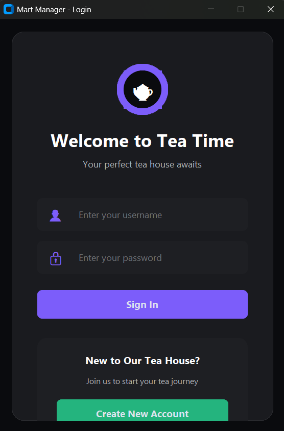
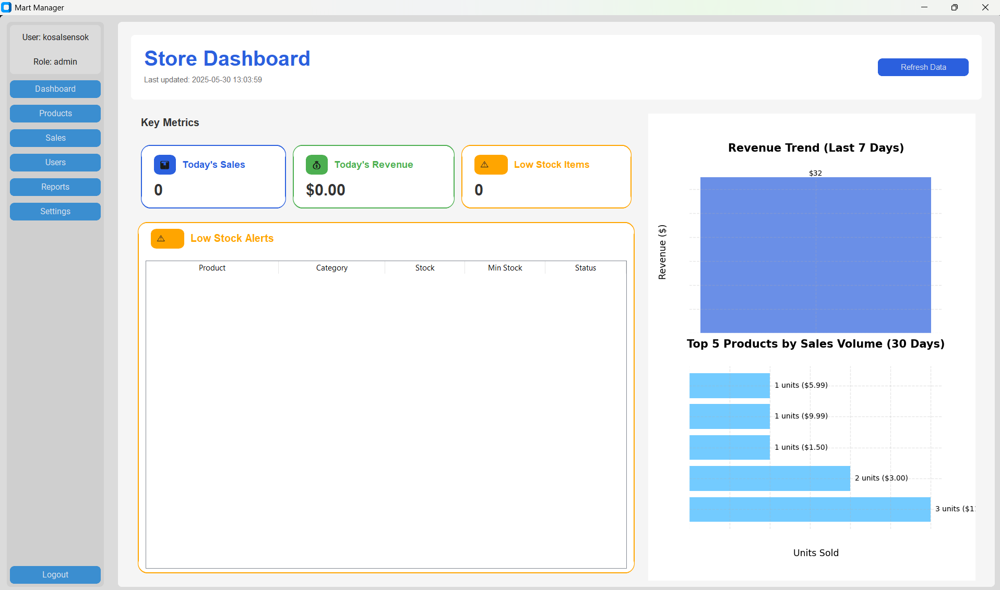
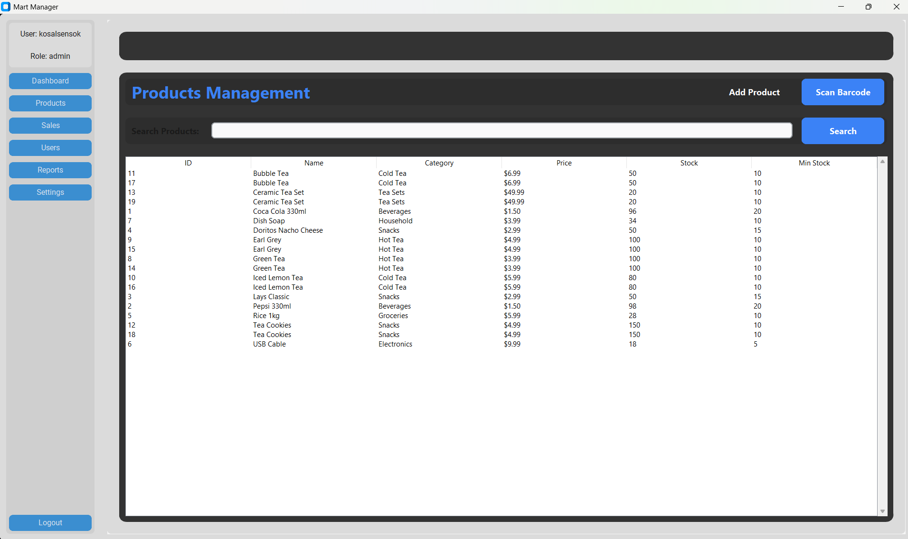
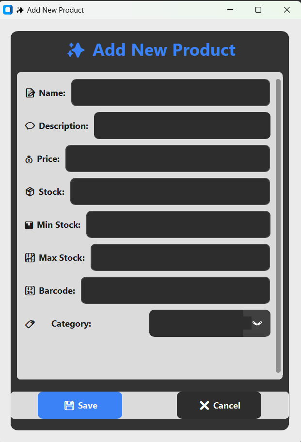
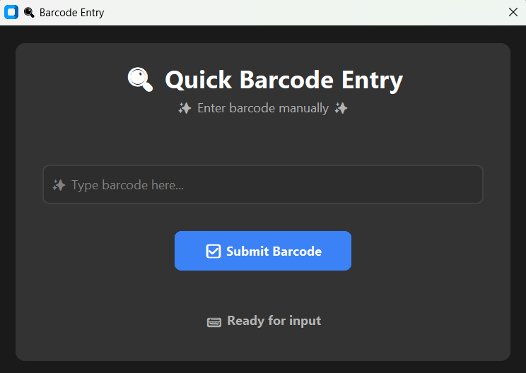
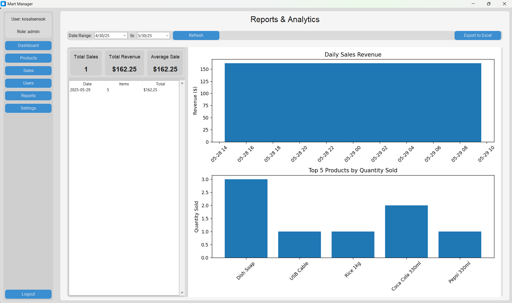
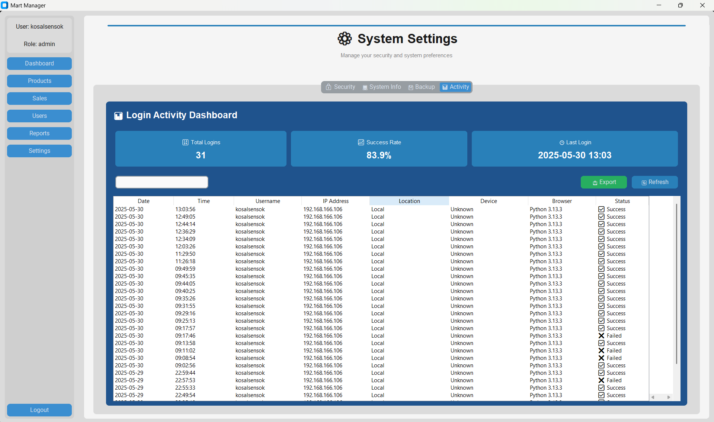

# 🏪 Mart-system

<div align="center">

[](https://github.com/KOSALSENSOK096/Mart-system)


<br/>

[](https://github.com/KOSALSENSOK096/Mart-system/stargazers)
[](https://github.com/KOSALSENSOK096/Mart-system/network/members)
[](https://github.com/KOSALSENSOK096/Mart-system/issues)
[](https://github.com/KOSALSENSOK096/Mart-system/pulls)
[](https://github.com/KOSALSENSOK096/Mart-system/blob/main/LICENSE)

<br/>

[ Live Demo](#) &nbsp;&nbsp;|&nbsp;&nbsp; 
[📝 Documentation](#) &nbsp;&nbsp;|&nbsp;&nbsp; 
[🐛 Report Bug](../../issues) &nbsp;&nbsp;|&nbsp;&nbsp; 
[✨ Request Feature](../../issues)

</div>

## 🎯 Overview

<div align="center">

</div>

A modern Tea House Management System with a beautiful dark-themed UI. Built with Python and CustomTkinter, it offers a seamless experience for managing your tea house operations.

## 📸 Screenshots

<div align="center">

### 🔐 Login & Registration



### 📊 Dashboard & Analytics


### 📦 Product Management




### 📈 Reports & Settings



</div>

## ✨ Features

<div align="center">

</div>

<br/>

<table>
<tr>
<td>

### 🔐 Security
- User Authentication (Login/Register)
- Role-based Access Control (Admin/Staff)
- Secure Password Hashing with BCrypt
- Session Management & Protection
- Data Encryption

</td>
<td>

### 📊 Management
- Product Management & Inventory
- Sales Tracking & Analytics
- User Management System
- Comprehensive Reports
- Automated Backups

</td>
</tr>
<tr>
<td>

### 🎨 Modern UI
- Dark Theme Support
- Responsive Design
- Beautiful Animations
- Intuitive Interface
- Custom Styling

</td>
<td>

### 🛠️ Technical
- Python 3.8+ Compatible
- MySQL Database
- Modular Architecture
- Extensible Design
- Regular Updates

</td>
</tr>
</table>

## 🚀 Technologies

<div align="center">

[](https://www.python.org/)
[](https://www.mysql.com/)
[](https://github.com/TomSchimansky/CustomTkinter)
[](https://pypi.org/project/bcrypt/)


</div>

## 🌟 Quick Start

<div align="center">

</div>

### Prerequisites
```bash
Python 3.8+
MySQL 5.7+
Git
```

### One-Line Install
```bash
git clone https://github.com/KOSALSENSOK096/Mart-system.git && cd Mart-system && pip install -r requirements.txt
```

### Run Application
```bash
python main.py
```

## 📁 Project Structure

```bash
mart-system/
├── 🖼️ assets/           # Static assets & resources
├── 💾 backups/         # Automated system backups
├── 📝 logs/            # System & error logs
├── 🧾 receipts/        # Generated sale receipts
├── 📂 temp/            # Temporary files
├── ⚙️ utils/           # Utility & helper functions
├── 🎨 views/           # UI components & views
├── ⚡ config.py        # System configuration
├── 🚀 main.py          # Application entry
└── 📦 requirements.txt # Dependencies
```

## 🤝 Contributing

<div align="center">

</div>

1. 🍴 Fork the Project
2. 🌱 Create your Feature Branch
   ```bash
   git checkout -b feature/AmazingFeature
   ```
3. 💫 Commit your Changes
   ```bash
   git commit -m '✨ Add some AmazingFeature'
   ```
4. 📤 Push to the Branch
   ```bash
   git push origin feature/AmazingFeature
   ```
5. 🔄 Open a Pull Request

## 📫 Support & Contact

<table>
<tr>
<td>

### 📱 Social
- Twitter: [@MartManager](#)
- Discord: [Join Server](#)
- LinkedIn: [Connect](#)

</td>
<td>

### 📧 Direct
- Email: support@martmanager.com
- Website: www.martmanager.com
- Phone: +XXX-XXX-XXXX

</td>
</tr>
</table>

## 📝 License

This project is licensed under the MIT License - see the [LICENSE](LICENSE) file for details.

## 🙏 Acknowledgments

<div align="center">

### Built With Amazing Tools

[](https://github.com/TomSchimansky/CustomTkinter)
[](https://www.mysql.com/)
[](https://code.visualstudio.com/)


### Made with ❤️ by [KOSAL SENSOK](https://github.com/KOSALSENSOK096)

<br/>

[](https://github.com/KOSALSENSOK096)
[](https://github.com/KOSALSENSOK096/Mart-system/stargazers)

⭐ Star us on GitHub — it motivates us a lot!


</div>
